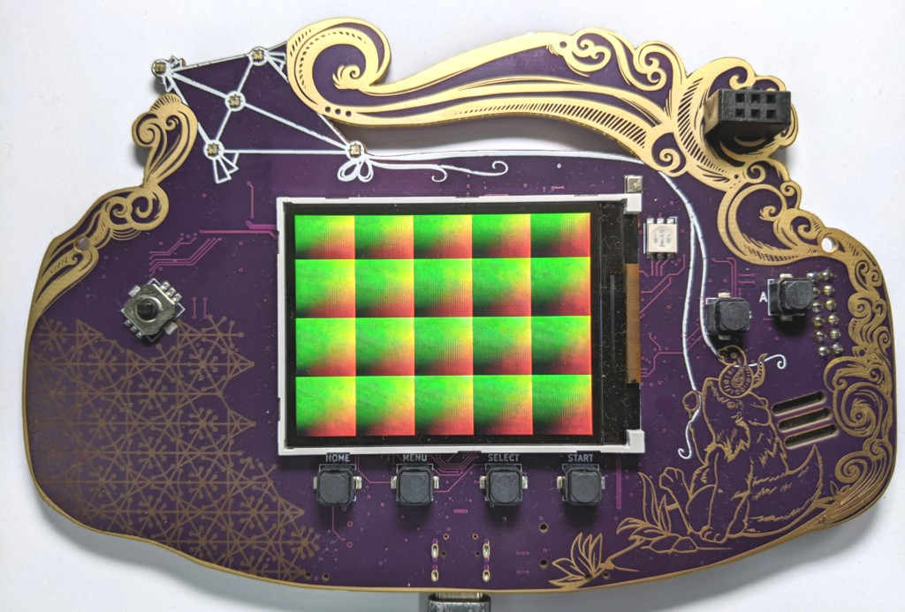

## Overview

A test pattern showing how to drive the LCD screen from a simple hardware
design written in Silice. Easy to hack and extend!

<center></center>

## Running the demo

Plug the badge, enter the directory and run `make mch2022`.

## Walkthrough

The first we do is to include the lcd controller in the design:

```c
// LCD screen controller
$include('../common/lcd.si')
```

Then we declare the main unit of the design (the main circuit that hosts everything else):

```c
// Main (top) design
unit main(
  output uint3 leds,
  output uint8 lcd_d,
  output uint1 lcd_rs,
  output uint1 lcd_wr_n,
  output uint1 lcd_cs_n(0),
  output uint1 lcd_rst_n(1),
  input  uint1 lcd_mode,
  input  uint1 lcd_fmark,
) {
```

Each input/output corresponds to a pin on the FPGA, connected to a peripheral.
Here we are only using the LEDs and LCD screen. See also the [Makefile](./Makefile), where we give `-p basic,lcd` to Silice so that it knows which sets of pins we want to use.

We don't really need to detail the `lcd_*` pins: these are all dealt with by
the [LCD controller](../common/lcd.si). To instantiate the controller in our
design we do:
```c
  lcd_driver lcd(<:auto:>);
  //             ^^^^^^^^ use autobinding for the pins
```
The use of `<:auto:>` here means that I ask for autobinding, which finds all inputs/outputs of the controller that match variables or inputs/outputs in the main unit and connect them. I
usually don't recommend autobinding, but here this is convenient to keep the
source compact and bind all these `lcd_*` pins (checkout the [controller signature](../common/lcd.si)).

Now that this is done we can use the LCD controller to send pixels, one byte at a time (pixels are 16 bits wide by the way, using 5-6-5 bits RGB):
```c
  lcd.data  = clr_l; // byte to send
  lcd.valid = 1; // controller sends when valid is high
```

This design is using Silice algorithm writing capability, for convenience.
The algorithm part is within the algorithm block:
```c
algorithm { ... }
```

We then define two variables, initialized to `0` at FPGA configuration:
```c
  uint9 x(0);
  uint8 y(0);
```

We then wait for the screen to be ready (the controller goes through a complete initialization sequence, sending a series of commands to the screen).
```c
  // wait for screen to be ready
  while (~lcd.ready) { }
```

Finally we loop over screen pixels forever (note this is a column by column traversal):
```c
  // we forever generate a simple pattern on screen
  while (1) {
    x = 0;
    while (x != 320) {
      y = 0;
      while (y != 240) {
        ...
        // next pixel
        y         = y + 1;
      }
      x = x + 1;
    }
  } // while (1)
```

And, the most important part, we generate our pattern!
```c
  uint5  r    <:: x[1,5]; // r track bits 1 to 6 of x
  uint6  g    <:: y[0,6]; // g tracks bits 0 to 6 of y
  uint5  b    <:: 0;      // b is zero
  uint16 clr  <:: {g[0,3],r,b,g[3,3]}; // assemble the 5-6-5 color
```
This produces a typical red-greed screen tiling, assembled from `x`, `y` coordinates
into a 16 bits RGB colors.

And finally we send the pixel to the screen! This happens across two cycles, since
the lcd controller sends one byte at a time. It can however send one byte every cycle.
Here's how this is done:

```c
    uint8  clr_l <: clr[0,8];
    uint8  clr_h <: clr[8,8];
    // each pixel is two bytes
    lcd.data  = clr_l;
    lcd.valid = 1;
++: // wait one cycle before sending second byte
    lcd.data  = clr_h;
    lcd.valid = 1;
```
We first decompose the pixel in two 8 bits part using expression trackers (hence
the `<:`). A tracker is just a rewrite (an alias). Then we send each byte, waiting
one cycle in between with the step operator `++:` that skips one cycle. This is required
so the lcd controller can send the first byte and accept the second one.

The internal while loop (`while (y != 240) { ... }`) sends one pixel every two cycles maximizing the screen throughput. Not that it matters in this simple example :)

## Conclusion

Now it's your turn to hack! Maybe modify the pattern (a xy xor effect might look good)?
Or produce an animated version counting frames and using the counter to generate
the animation?

Have fun, nothing can break!

> **Note:** Feedback is most welcome, please let me know what you thought about
this write up.

## Bonus: Verilog export

I added an example of how to export from Silice to Verilog and use the LCD driver zritten in Silice from a Verilog design. To test, run `make verilog`. The export is done in the [`Makefile`](Makefile) in this folder (target *verilog*). For how the module is used see [`verilog/top.v`](verilog/top.v).
